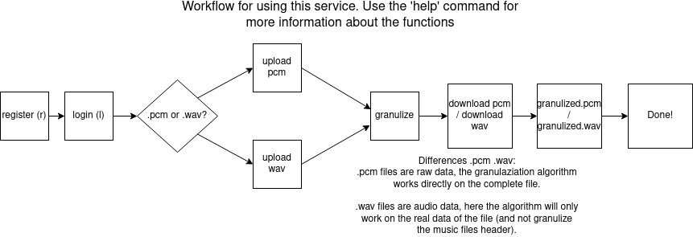

# enowars7-service-granulizer
Vulnerable granular synthesizer service 

## Service Description
- Command-line service with user authentication, which generates .wav / .pcm files for users
- performs a reversible granulization algorithm on the uploaded file

## Command Features
- user register
- user login
- upload
    uploads a music file, either .wav or .pcm (raw data)
- granulize
    performs granular synthesis on uploaded music
- download
    downloads a music file, either .wav or .pcm
- granulize info
    returns more details about the last performed granulization

## Exploits
    Path traversal on granulize command, returns granulized data from other user.
    Together with "granulize info" the original can be recalculated and the flag can be retrieved.

